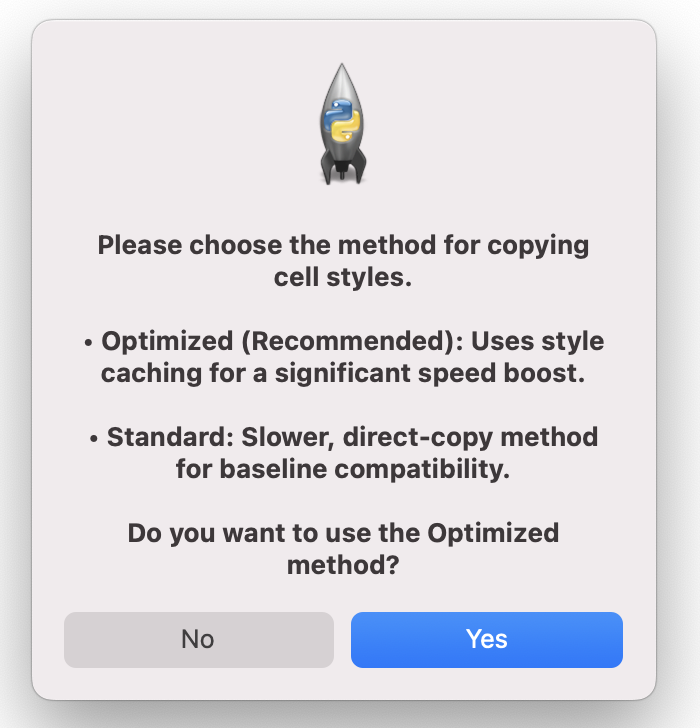
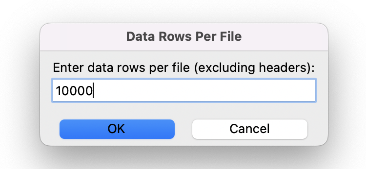
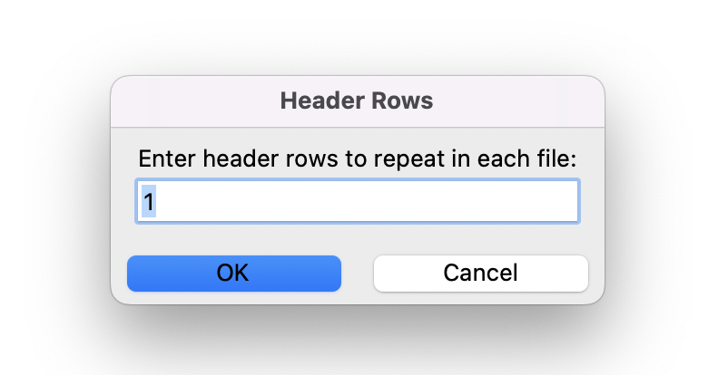
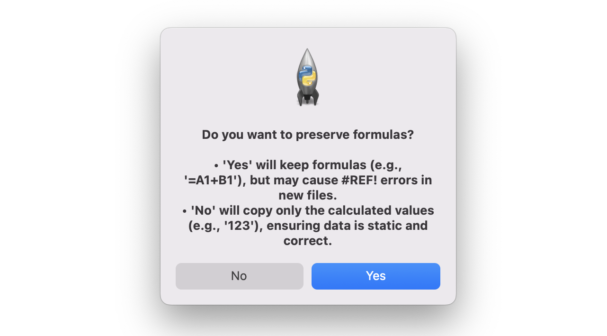
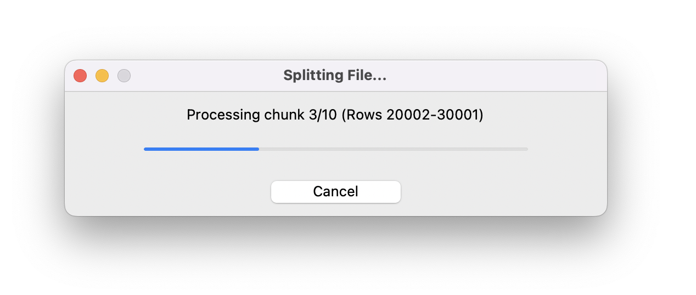
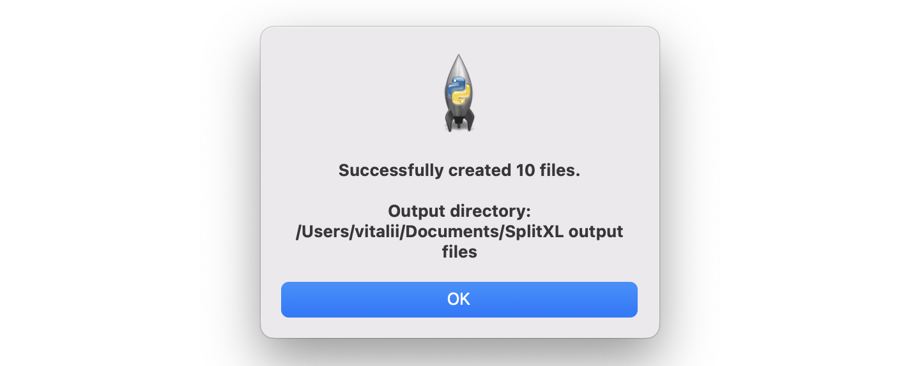
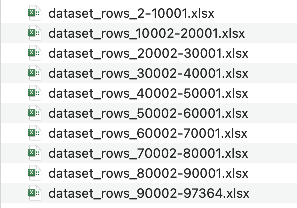
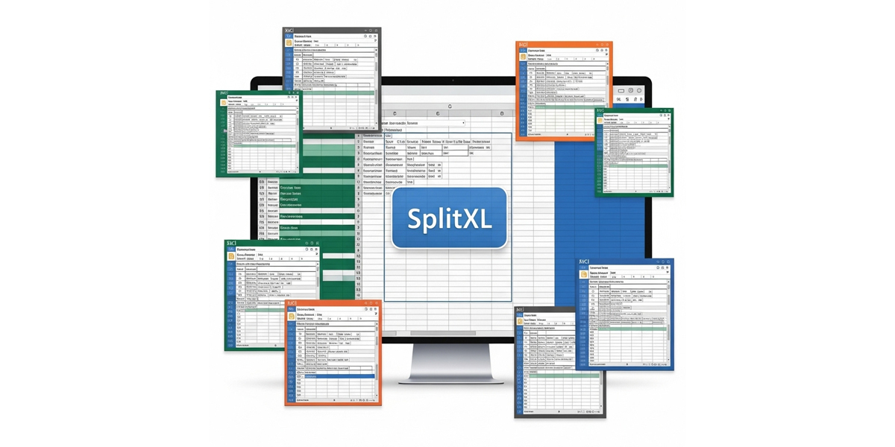

# SplitXL

A GUI-based utility for splitting a large Excel file into smaller, more manageable chunks while preserving cell formatting, styles, and formulas. The application runs the splitting process in a separate thread to ensure the user interface remains responsive, providing real-time progress updates and a cancellation option 📊✂️


 

**➡️ Read more about the project, its features, and development in my [Medium story.](https://medium.com/@starosta/split-large-excel-with-python-e1e6453c91f9)** 


## Table of Contents

- [Overview](#overview)
- [Key Features](#key-features)
- [Installation](#installation)
- [Usage](#usage)
- [Project Structure](#project-structure)
- [Development](#development)
- [Known Issues](#known-issues)
- [Contributing](#contributing)
- [License](#license)
- [Contact](#contact)

## Overview

SplitXL addresses the common challenge of working with massive Excel files that are slow to open, edit, and share. This tool provides an intuitive graphical interface to break down any `.xlsx` file into smaller files based on a specified number of rows.

The core strength of SplitXL is its ability to meticulously preserve the original file's integrity. It copies not just the data but also all cell formatting, styles, comments, merged cell ranges, and column/row dimensions. The entire operation runs in a background thread, so the application never freezes, and you can monitor its progress or cancel it at any time.

A typical workflow involves:
1.  Launching the script and selecting an input Excel file.
2.  Choosing an output directory.
3.  Selecting between an Optimized (fast) or Standard processing method.
4.  Configuring the split parameters: data rows per file and header rows to repeat.
5.  Deciding whether to keep formulas or convert them to static values.
6.  Monitoring the non-blocking progress window.
7.  Receiving a summary report upon completion, cancellation, or error.

## Key Features

-   **Optimized Processing Engine:** Features a high-performance mode that uses style caching to dramatically speed up the splitting process on files with extensive formatting.
-   **Rich Formatting Preservation:** Faithfully copies fonts, colors, borders, fills, number formats, and alignments.
-   **Non-Blocking GUI:** The splitting process runs in a separate thread, keeping the UI fully responsive.
-   **Real-Time Progress Tracking:** A dedicated window shows the current status, a progress bar, and the percentage complete.
-   **Graceful Cancellation:** A "Cancel" button allows the user to stop the process at any point, preventing incomplete or corrupt files.
-   **Formula or Value Preservation:** Users can choose to either keep formulas intact (which may result in `#REF!` errors) or save only the calculated static values for data integrity.
-   **Header Row Repetition:** Automatically repeats a specified number of header rows in each new split file.
-   **Comprehensive Metadata Copying:** Preserves column widths, row heights, merged cells, and hyperlinks.

## Installation

### Prerequisites

-   Python 3.6+
-   A graphical desktop environment is required to run the `tkinter`-based GUI.

### Clone the Repository

```bash
git clone https://github.com/sztaroszta/SplitXL.git
cd SplitXL 
```

### Install Dependencies

You can install the required dependency using pip:

```bash
pip install -r requirements.txt
```

*Alternatively, install the dependency manually:*

```bash
pip install openpyxl
```

## Usage

**1. Run the application:**

```bash
python excel_splitter.py
```

2.  **Follow the GUI Prompts:**
    *   **Select Input File:** A dialog will ask you to choose the `.xlsx` file you want to split.
    *   **Select Output Directory:** Choose a folder where the new, smaller files will be saved. It defaults to the input file's location.
    *   **Choose Processing Method:** You will be prompted to select between an "Optimized" (recommended for speed) and "Standard" cell copying method.
    <p align="center">  </p>
    
    *   **Configure Rows:** Enter the number of data rows you want in each chunk and how many header rows from the original file should be repeated at the top of each new file.
    <p align="center">  <br> 
     </p>
    
    *   **Preserve Formulas:** A dialog box will ask if you want to keep formulas or save their calculated values. Choosing 'No' is safer for preventing broken references in the split files.
    <p align="center">  </p>
3.  **Monitor Progress:**
    *   A progress window will appear, showing the current status and a progress bar. You can click "Cancel" at any time to halt the operation.
    <p align="center">  </p>
4.  **Verify Success:**
    *   Upon completion, a summary dialog will report the outcome (success, cancellation, or error) and the total number of files created.
    <p align="center">  </p>
    
    *   The split files will be located in your chosen output directory, named with the original filename and the row range they contain (e.g., `original_file_rows_2-5001.xlsx`). 
    <p align="center">  </p>

## Project Structure

```
SplitXL/
├── excel_splitter.py       # Main script for running the tool
├── README.md               # Project documentation
├── requirements.txt        # List of dependencies
├── .gitignore              # Git ignore file for Python projects
├── assets/                 # Contains screenshots of the application's UI
└── LICENSE                 # GNU GPLv3 License File
```

## Development

**Guidelines for contributors:**

If you wish to contribute or enhance SplitXL:
-   **Coding Guidelines:** Follow Python best practices (PEP 8). Use meaningful variable names and add clear comments or docstrings.
-   **Testing:** Before submitting changes, please test them locally by running the script with various Excel files to ensure existing functionality is not broken.
-   **Issues/Pull Requests:** Please open an issue or submit a pull request on GitHub for enhancements or bug fixes.

## Known Issues

-   **Formula References:** If you choose to preserve formulas, any formulas that reference cells outside the current chunk (e.g., in a different split file) will result in `#REF!` errors in the output file. This is an inherent limitation of splitting formula-dependent data.
-   **Platform Dependency:** The script requires a desktop environment with a graphical display to run, as it is built with `tkinter`. It will not run in a headless environment (like a standard server SSH session).

## Contributing

**Contributions are welcome!** Please follow these steps:

1.  Fork the repository.
2.  Create a new branch for your feature or fix.
3.  Commit your changes with descriptive messages.
4.  Push to your fork and submit a pull request.

For major changes, please open an issue first to discuss the proposed changes.

## License

Distributed under the GNU General Public License v3 (GPLv3) License.
See [LICENSE](LICENSE) for full details.


## Contact

For questions, feedback, or support, please open an issue on the [GitHub repository](https://github.com/sztaroszta/SplitXL/issues) or contact me directly: 

[](https://www.linkedin.com/in/vitalii-starosta)
[](https://github.com/sztaroszta)
[](https://gitlab.com/sztaroszta)
[](https://bitbucket.org/sztaroszta/workspace/overview)
[]( https://gitea.com/starosta) 

Project Showcase: [sztaroszta.github.io](https://sztaroszta.github.io)

```
Split smarter, not harder!
```

**Version:** 8  
**Concept Date:** 2024-03-25 

<p align="center"> </p>
